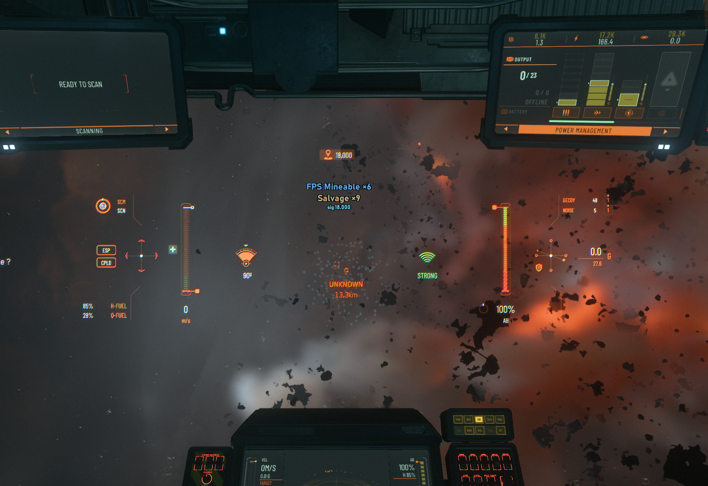
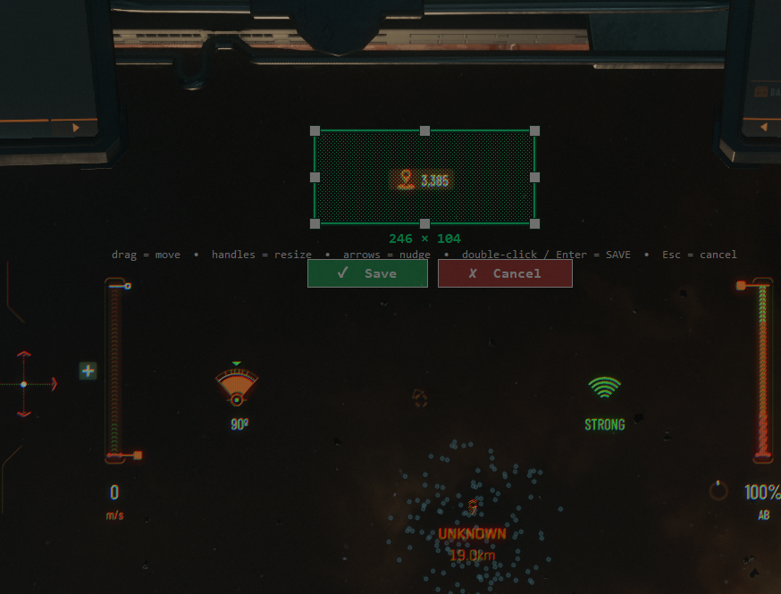
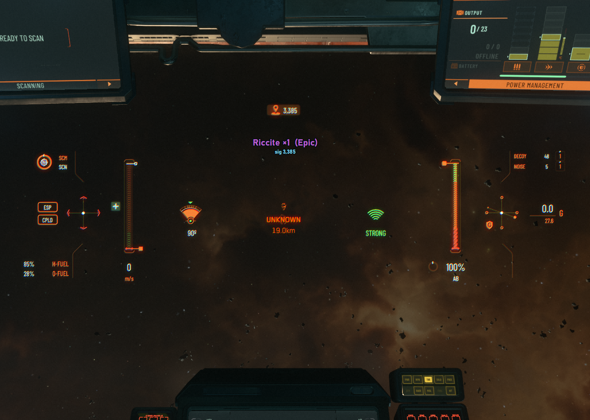
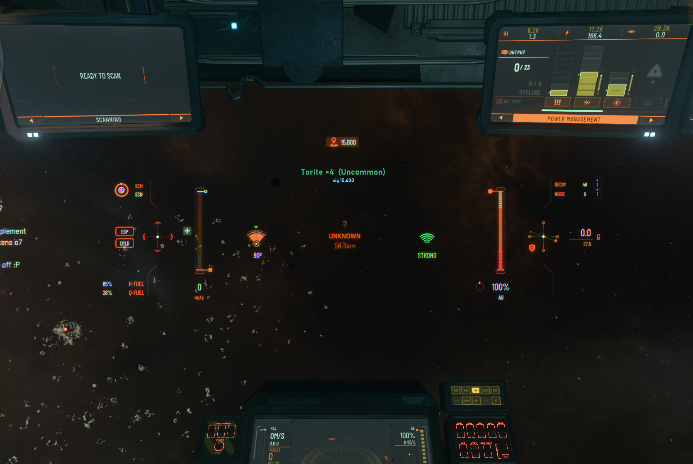
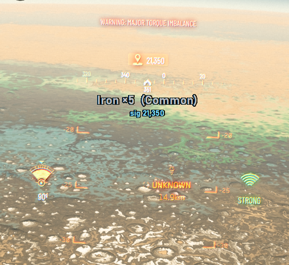

# sig-translator

A lightweight, always-on overlay for **Star Citizen** mining & salvage. It reads the
scanner **signature number** off your screen and instantly tells you **what material**
it is and **how many nodes** are in the cluster.

> Example: your scanner shows `6,770` → the overlay shows **Riccite ×2**.

No install, no dependencies, nothing to keep updated — download one `.exe` and run it.

---

## Download

1. Go to the **[latest release](../../releases/latest)** and download
   `sig-translator-vX.Y.Z.exe`.
2. Run it. The first time, Windows SmartScreen may say *"Windows protected your PC /
   unknown publisher."* That's only because the app isn't code-signed (it costs money
   to sign a hobby tool). Click **More info → Run anyway**. See
   [Is this safe?](#is-this-safe-eac--bans) below.

## Setup (once)

1. Run the exe — a small **control panel** opens.
2. Click **Calibrate box…**. A selection box appears over your screen:
   - **Drag inside** it to move, **drag the handles** to resize, **arrow keys** to nudge.
   - Put it over the spot where the **signature number** shows on your mining/salvage HUD.
   - **Save** (button, double-click, or Enter).
3. That's it. Calibration is saved — you only redo it if your HUD/resolution changes.

> Calibration is required on first launch; the app won't scan until the box is set.

> Multi-monitor is supported — calibrate on whichever screen the game is on.

## Using it

- Scan a rock or wreck. A label appears just below the number showing the **material**
  (colored by rarity) and a `sig 6,770` line echoing the number it read, so you can
  double-check at a glance.
- Turn the overlay **on/off** with the big button in the panel or the global hotkey
  (**Ctrl+Alt+S** by default).
- When there's no signature on screen, the overlay shows nothing.

The material name is colored by its rarity tier, with the scanned signature echoed
underneath — and it works the same in space or on a planet surface:

  
  
  

## Settings (in the control panel)

| Setting | What it does |
|---|---|
| **Capture on/off** | Big button + global hotkey (editable). |
| **Scan FPS** | How often it reads the screen. |
| **Accent color** | Color picker for the readout tint — match your ship manufacturer's HUD color. |
| **Label size** | Overlay text size. |
| **Show rarity** | Show or hide the rarity tier after the name, e.g. `Riccite ×2 (Epic)`. |

Settings are saved to `%APPDATA%\sig-translator\config.json` (Windows).

ROC / FPS / Salvage deposits share some signature values (e.g. `18,000` could be
**FPS ×6** *or* **Salvage ×9**); when a number is genuinely shared, the overlay always
shows every valid reading so you can decide.

## Is this safe? (EAC / bans)

This tool is designed to be as low-risk as possible: it never touches, injects into, or
reads the game itself. It only takes a read-only screenshot of a small part of your
**desktop** — the same thing OBS and screenshot tools do — and draws a separate window
on top, so EasyAntiCheat doesn't interact with it in any way. It only surfaces
information that's already on your own screen. That said, it's an unofficial third-party
tool, and CIG's EULA gives them broad discretion over what they allow, so — as with any
community overlay, calculator, or trade app — use it at your own discretion. If you want
absolute certainty, CIG is always the final word.

## Troubleshooting

- **Wrong number, or no label appears:** re-calibrate so the box hugs *just* the number.
  The `sig …` echo line tells you what it read.
- **Label in the wrong place:** it sits just below your calibrated box — move the box.
- **Two/three materials shown:** that signature is genuinely shared between deposit types
  (ROC/FPS/Salvage), so the app shows every valid reading — pick the one that matches
  what you're actually scanning.

## How it works (short version)

Every deposit type has a fixed radar signature, and the scanner shows
`signature × node count`. The app divides the number you scanned by the known base
values to recover the material and the node count. Those values are baked into the app,
so it works offline and never needs updating.
